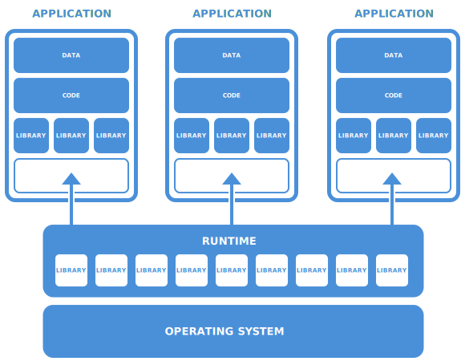

Introduction to Flatpak
=======================

Flatpak is a technology for building, distributing, installing and running applications. It is primarily targetted at the Linux desktop, although it can also be used as the basis for application distribution in other contexts, such as embedded systems.

Flatpak has been designed and implemented with a number of goals:

* Allow applications to be installed on any Linux distribution.
* Provide consistent environments for applications, to facilitate testing and reduce bugs.
* Decouple applications from operating system, so that applications don't depend on specific versions of each distribution.
* Allow applications to bundle their own dependencies, so that they can use libraries that aren't provided by a Linux distribution, and so they can depend on specific versions or even patched versions of a library.
* Increase the security of Linux desktops, by isolating applications in sandboxes.

Flatpak makes it easy to take advantage of these features. If you haven't already, it is recommended that you try the `hello world <http://flatpak.org/hello-world.html>`_ example, as a way of getting started.

More information about Flatpak can be found on `flatpak.org <http://flatpak.org/>`_.

How it works
------------

Familiarity with a few key concepts is enough to understand how Flatpak works, as well as how it differs from traditional software packages.

Runtimes
^^^^^^^^

Runtimes provide the basic dependencies that applications might require. Various runtimes are available, from more minimal (but more stable) Freedesktop runtimes, to larger runtimes produced by desktops like GNOME or KDE. (The `runtimes page <http://flatpak.org/runtimes.html>`_ on flatpak.org provides an overview of the runtimes that are currently available.)

Each application must be built against a runtime, and this runtime must be installed on a host system in order for the application to run. Users can install multiple different runtimes at the same time, including different versions of the same runtime.

.. tip::
  Each runtime can be thought of as a ``/usr`` filesystem. Indeed, when an application is run, its runtime is mounted at ``/usr``.

.. note::
  Flatpak identifies runtimes (as well as SDKs and applications) by a triple of name/arch/branch. The name is expected to be in inverse-dns notation, which needs to match the D-Bus name used for the application. For example: ``org.gnome.Sdk/x86_64/3.14`` or ``org.gnome.Builder/i386/master``.

Bundled libraries
^^^^^^^^^^^^^^^^^

If an application requires any dependencies that aren't in its runtime, they can be bundled along with the application itself. This allows applications to use dependencies that aren't available in a distribution, or to use a different version of a dependency from the one that's installed on the host.

.. note::
  Both runtimes and app bundles can be installed per-user and system-wide.

SDKs (Software Developer Kits)
^^^^^^^^^^^^^^^^^^^^^^^^^^^^^^

An SDK is a runtime that includes the 'devel' parts which are not needed at runtime, such as build and packaging tools, header files, compilers and debuggers. Each application is built against an SDK, which is typically paired with a runtime (this is the runtime that will be used by the application at runtime).

Extensions
^^^^^^^^^^

An extension is an optional add-on for a runtime or application. They are most commonly used to split out translations and debug info from runtimes. For example, ``org.freedesktop.Platform.Locale`` can be added to the ``org.freedesktop.Platform`` runtime in order to enable translations.

Sandboxes
^^^^^^^^^

With Flatpak, each app is built and run in an isolated environment. By default, the application can only 'see' itself and its runtime. Access to user files, network, graphics sockets, subsystems on the bus and devices have to be explicitly granted. (As will be described later, Flatpak provides several ways to do this.) Access to other things, such as other processes, is (deliberately) not possible.

The flatpak command
--------------------

``flatpak`` is the command that is used to install, remove and update runtimes and applications. It can also be used to view what is currently installed, and has commands for building and distributing application bundles. ``flatpak --help`` provides a full list of available commands.

Most flatpak commands are performed system-wide by default. To perform a command for the current user only, use the ``--user`` option.

Under the hood
--------------

Flatpak uses a number of pre-existing technologies. It generally isn't necessary to be familiar with these in order to use Flatpak, although in some cases it might be useful. They include:

* The `bubblewrap <https://github.com/projectatomic/bubblewrap>`_ utility from `Project Atomic <http://www.projectatomic.io/>`_, which lets unprivileged users set up and run containers, using kernel features such as:

  * Cgroups
  * Namespaces
  * Bind mounts
  * Seccomp rules

* `systemd <https://www.freedesktop.org/wiki/Software/systemd/>`_ to set up cgroups for sandboxes
* `D-Bus <https://www.freedesktop.org/wiki/Software/dbus/>`_, a well-established way to provide high-level APIs to applications
* The OCI format from the `Open Container Initiative <https://www.opencontainers.org/>`_, as a convenient transport format for single-file bundles
* The `OSTree <https://ostree.readthedocs.io/en/latest/>`_ system for versioning and distributing filesystem trees
* `Appstream <https://www.freedesktop.org/software/appstream/docs/>`_ metadata, to allow Flatpak applications to show up nicely in software-center applications

